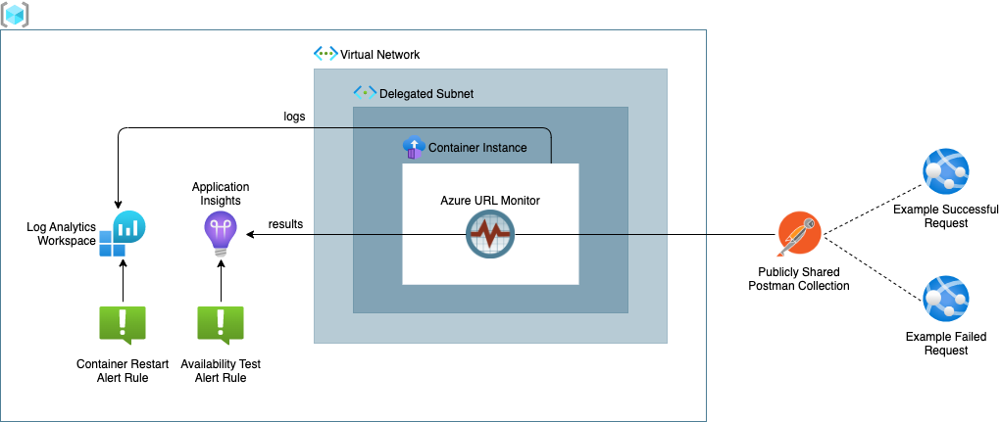
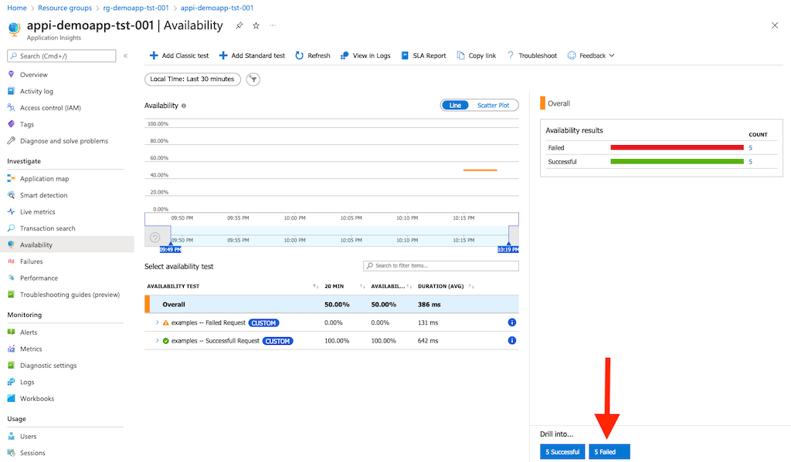
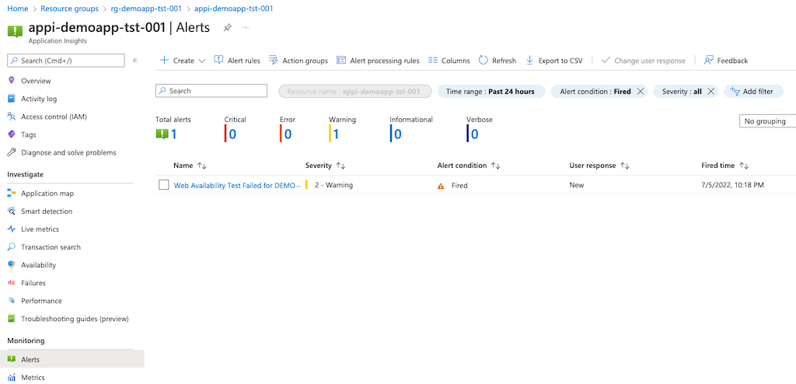

# Introduction
Deploys a complete set of resources to take the url monitor for a spin. Resources deployed:
- Resource Group
- Log Analytics Workspace
- Application Insights Instance
- Vnet with subnet delegated to 'Microsoft.ContainerInstance/containerGroups' service
- Container Instance with Vnet integration
- Web Availability Test Alert Rule
- Container Restart Alert Rule

Although the VNet integration is not necessary for the demo deployment it showcases an environment for running tests against private endpoints.



# Deployment

The deployment has been prepared with default parameters values. You can override the default values using a [parameter file](https://docs.microsoft.com/en-us/azure/azure-resource-manager/templates/parameter-files).

To deploy this demo using the default values run the following commands:

```
 $ az login
 $ az account set --subscription <YOUR SUBSCRIPTION ID> 
 $ az deployment sub create --location <YOUR LOCATION> --template-file main.bicep 
```

To deploy this demo using your own parameter file run the following commands:

```
 $ az login
 $ az account set --subscription <YOUR SUBSCRIPTION ID> 
 $ az deployment sub create --location <YOUR LOCATION> --template-file main.bicep  --parameters @your.parameters.json
```

# Verify Deployment

## Availability Test Results

After a successful deployment it might take a couple of minutes for the container instance to pull the image and start the url monitor container. To see the results goto the demo **Application Insights** resource in the Azure portal and select `Availability` from the left menu. This will show the results of the two Test Requests. To see the test result details click on the `Failed` button on the bottom rights and select one of the failed tests. 



## Availability Test Alerts

From the **Application Insights** interface select `Alerts` from the left menu. This will show an alert for the failed test.



# Running Your Own Tests 

Get yourself familiar with [Postman](https://www.postman.com/).

## Publicly Shared Collection

- `Share` your Postman collection using a JSON link 
- Copy the url and pass that to the `postman_collection_url` parameter of the `main.bicep` file
- Re-run the deployment 

## Exported Collection

- `Export` your Postman collection  
- Store the json file on storage that is accessible from the Container Instance. (eg Azure Blob Storage)
- Pass the url to the `postman_collection_url` parameter of the `main.bicep` file
- Re-run the deployment