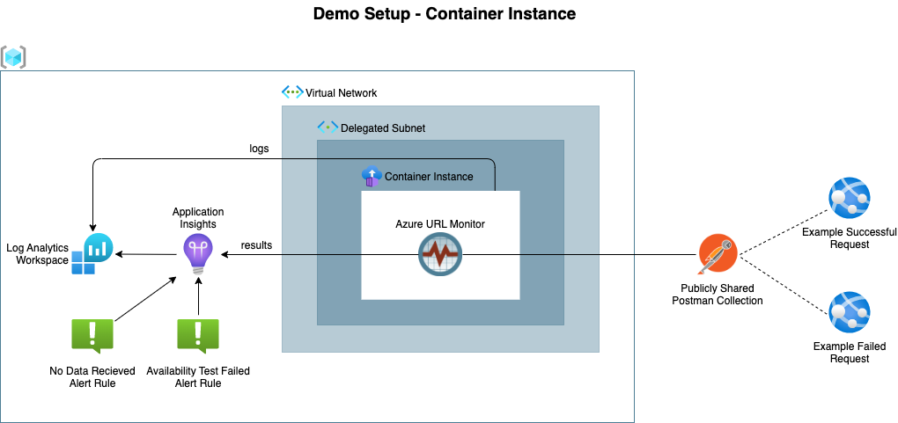
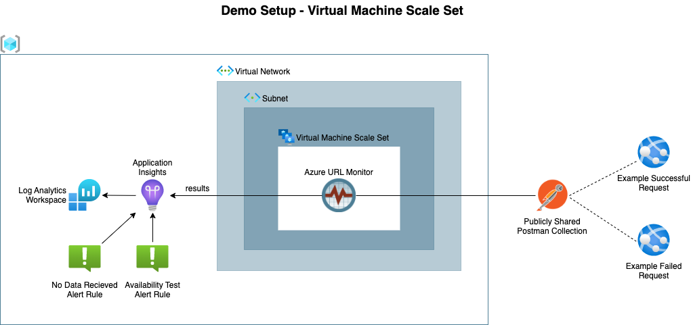

# Introduction
This Bicep deployment creates and configures all necessary resources to take the url monitor for a spin. It show cases a deployment of the url monitor container on a Container Instance and a Virtual Machine Scale Set. 

Resources deployed:
- Resource Group
- Log Analytics Workspace
- Application Insights Instance
- Virtual Network 
- Container Instance with Vnet integration OR Virtual Machine Scale Set
- Availability Test Failed Alert Rule
- No Data ALert Rule

The deployment uses a pre-defined shared Postman collection that includes one successful and one failing request.

# Deployment 
## Container Instance Scenario

The Container Instance is deployed with VNET integration so it can be used to monitor private endpoints. The VNET integration does require a dedicated subnet that is delegated to `Microsoft.ContainerInstance/containerGroups`. If the scenario is deployed with the default options an appropriate VNET is created.




To deploy this scenario with the default options run:

```
 $ az login
 $ az account set --subscription <YOUR SUBSCRIPTION ID> 
 $ az deployment sub create --location <YOUR LOCATION> --template-file main.bicep  --parameters deployment_mode=container_instance
```

## Virtual Machine Scale Set Scenario

In this scenario the container is started on Linux Virtual Machine that is part of a Scale Set. Compared to a Container Instance deployment the Virtual Machine Scale Set deployment has the following advantages:
- No need for a delegated subnet
- On average 3 times cheaper
- More flexibility on container settings

The last point comes in handy when you want to for example pass additional host mappings to the container's `/etc/hosts` file for specific monitoring scenarios. This option is controlled via `compose_extra_hosts`  deployment parameter.



To deploy this scenario with the default options run:

```
 $ az login
 $ az account set --subscription <YOUR SUBSCRIPTION ID> 
 $ az deployment sub create --location <YOUR LOCATION> --template-file main.bicep  --parameters deployment_mode=virtual_machine_scale_set
```

## Customizing Deployments

To override specific deployment it is best to use a [parameter file](https://docs.microsoft.com/en-us/azure/azure-resource-manager/templates/parameter-files). Examples can be found in the `/bicep/parameters/` folder. 

To deploy this demo using your own parameter file run:
```
 $ az login
 $ az account set --subscription <YOUR SUBSCRIPTION ID> 
 $ az deployment sub create --location <YOUR LOCATION> --template-file main.bicep  --parameters @your.parameters.json
```


# Verify Deployment

## Availability Test Results

After a successful deployment it might take a couple of minutes before the environment is ready. To see the test results goto the demo **Application Insights** resource in the Azure portal and select `Availability` from the left menu. This will show the results of the two test requests. 

To see the test result details click on the `Failed` button on the bottom rights and select one of the failed tests (initially there might be an additional delay before the individual test results start showing up...be patient). 


## Availability Test Alerts

From the **Application Insights** interface select `Alerts` from the left menu. This will show an alert for the failed test.


# Running Your Own Tests 

Get yourself familiar with [Postman](https://www.postman.com/).

## Publicly Shared Collection

- `Share` your Postman collection using a JSON link 
- Copy the url and pass that to the `postman_collection_url` parameter of the `main.bicep` file
- Re-run the deployment 

## Exported Collection

- `Export` your Postman collection  
- Store the json file on storage that is accessible from the Container Instance. (eg Azure Blob Storage)
- Pass the url to the `postman_collection_url` parameter of the `main.bicep` file
- Re-run the deployment